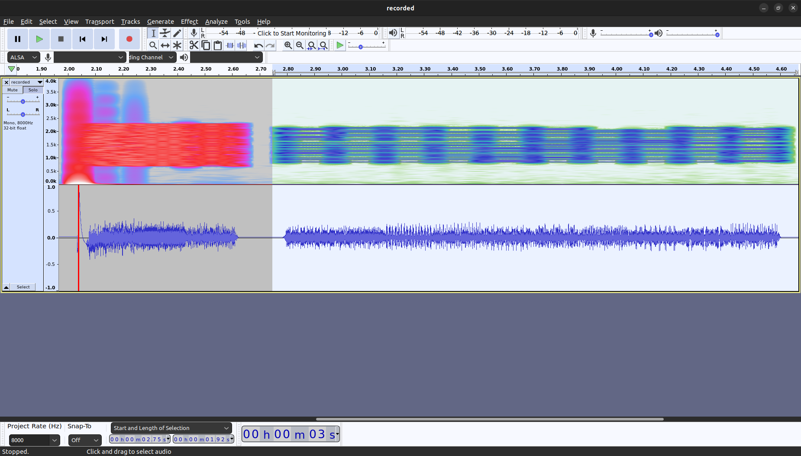

# Building rattlegram, short branch
## Installation instructions
```
$ mkdir rattlegram-modem
$ cd rattlegram-modem/
$ git clone git@github.com:aicodix/dsp.git
$ git clone git@github.com:aicodix/code.git
$ git clone git@github.com:aicodix/modem.git
$ cd modem/
$ git checkout short
```
Edit `Makefile` and select the g++ compiler instead of clang++
```
#CXX = clang++ -stdlib=libc++ -march=native
CXX = g++ -march=native
```
Run make
```
make
```

# Rattlegram decoder
* Don't try to decode audio files containing multiple packets.  The decoder will exit with a payload decoding error.

## Test setup
### Hardware
- USB sound card
- Tablet running Rattlegram

### Hardware connections
* 3.5mm audio cable from tablet (tip = left out, ring2 = gnd) to sound card (tip = mic in, sleeve = gnd)
* Remove charging cable from tablet to avoid ground loops

### Software setting
* audio output from tablet set to around 50% (on the edge of the red zone that indicates possible hearing loss when listened to for too long)
* Using [an online 1kHz sine wave generator](https://onlinesound.net/tone-generator), with the output set to 100% we can measure that the audio output of the tablet is around 130mVpp (unloaded).
* The microphone input of the sound card is set to 50% (using `pactl set-source-volume alsa_input.usb-GeneralPlus_USB_Audio_Device-00.mono-fallback 50%`)

## Test procedure
* Start recording (5s) on the sound card : `arecord -c 1 -f S16_LE -r 8000 -d 5 recorded.wav`
* Play the ping (bell) on the rattlegam app
* The recorded audio packet is 1.44s long.

### Decode the recorded audio
```
$ ./decode decoded.dat ~/git/rattlegram-openmodem/doc/technology-research/recorded.wav 
symbol pos: 2335
coarse cfo: 1500.41 Hz 
oper mode: 0
call sign: ANONYMOUS
```

### Rattlegram encoder settings
* **Channel select** : default (left channel), first (left channel), second (right channel), analytic (both channels)
* **Leading noise** : >= 0.25s : when using VOX on your transceiver, this will ensure that the transceiver is in TX mode when the packet is sent.  The total packet length is 550ms.  This works, but it wastes battery power.  Use the PTT-switching feature of the modem instead.
* **Fancy header** : adds 3s of tail data to the packet.  No idea what this is for.
* **Operating mode** : automatically configured based on the packet length:
  * empty packet : mode 0
  * length <= 85 (680 bits): mode 16 : strong protection
  * length <= 128 (1024 bits): mode 15 : medium protection
  * length <= 170 (1360 bits): mode 14 : normal protection

<figure>
    
    <figcaption>250ms white noise lead, mode 0, fancy header enabled</figcaption>
</figure>

# Rattlegram decoder
## Test setup
### Hardware
- USB sound card
- Tablet running Rattlegram

### Hardware connections
* 3.5mm audio cable from tablet (sleeve = mic in, ring2 = gnd) to sound card (tip = audio out, sleeve = gnd)
* Remove charging cable from tablet to avoid ground loops

### Software setting
* Using [an online 1kHz sine wave generator](https://onlinesound.net/tone-generator), with the output set to 100%, we can check the audio level on the tablet using the "Sound Wave" app.  The MIC-level on the tablet seems to have some AGC.
* The audio output of the sound card is set to 50% (using `pactl set-sink-volume alsa_output.usb-GeneralPlus_USB_Audio_Device-00.analog-stereo 50%`).  25% seems to be the minimum level that the tablet can decode.
* This results in a 330mVpp audio output signal from the sound card (unloaded).

## Test procedure
* Run the Rattlegram app on the tablet
* Create a new packet using the encoder : `./encode encoded.wav 8000 0 1 uncoded.dat 1500 ANONYMOUS`
* Play the packet on the sound card : `aplay -c 1 -f S16_LE -r 8000 encoded.wav`

## Minimal distance between packets
### Test setup
* Use the encoded.wav and open it with Audacity.  Paste the packet after itself, and play the result using the sound card.
* By adding and removing dead space, we can measure the minimal distance between packets that the decoder can handle.

### Results
* 0.50s is not enough, 0.6s works with 25% audio level
* 0.06ms is enough with 50% audio level